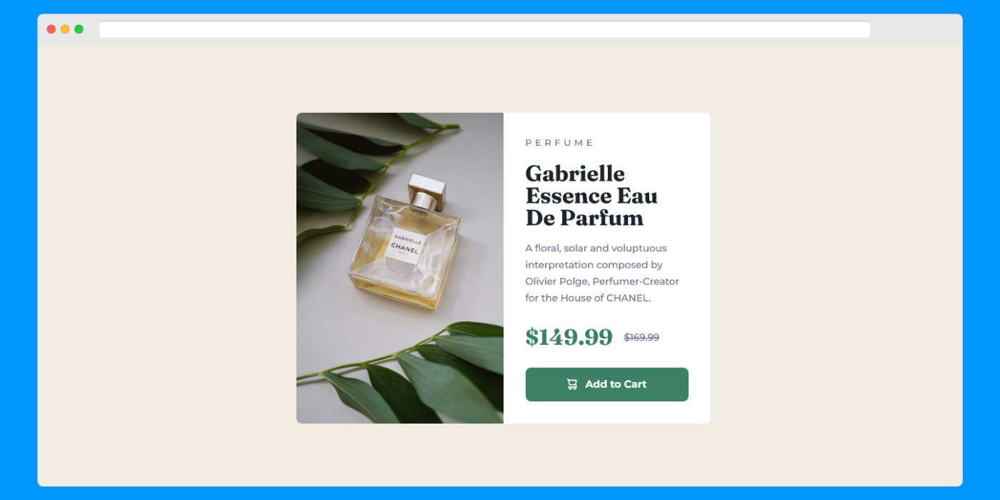
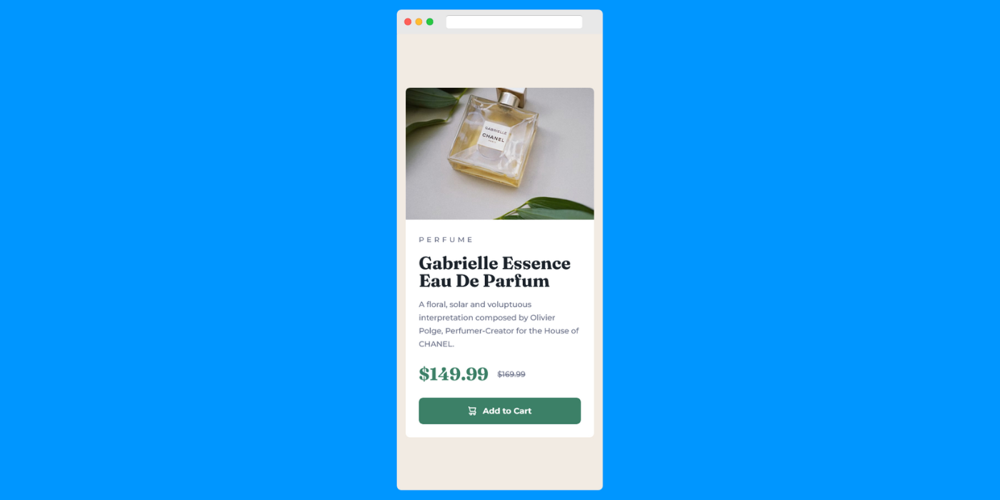

# Frontend Mentor - Product Preview Card Component Solutions

This is a solution to the [Product preview card component challenge on Frontend Mentor](https://www.frontendmentor.io/challenges/product-preview-card-component-GO7UmttRfa). Frontend Mentor challenges help you improve your coding skills by building realistic projects.

## Table of contents

- [Overview](#overview)
  - [The challenge](#the-challenge)
  - [Screenshot](#screenshot)
  - [Links](#links)
- [My process](#my-process)
  - [Built with](#built-with)
- [Author](#author)

## Overview

### The challenge

#### Users should be able to:

- View the optimal layout depending on their device's screen size
- See hover and focus states for interactive elements

### Screenshot

### Links

- Solution URL: [Solutions](https://github.com/Toufiq-Gilani/product-preview-card-component-solutions)
- Live Site URL: [Live Version](https://toufiq-gilani-blog-008.netlify.app/)

## My process

### Built with

- Semantic HTML5 Markup
- CSS Custom Properties
- Flexbox
- CSS Grid
- Mobile-first workflow

## Author

- Frontend Mentor - [@Toufiq-Gilani](https://www.frontendmentor.io/profile/Toufiq-Gilani)
- Twitter - [@GilaniRabbu](https://twitter.com/GilaniRabbu)